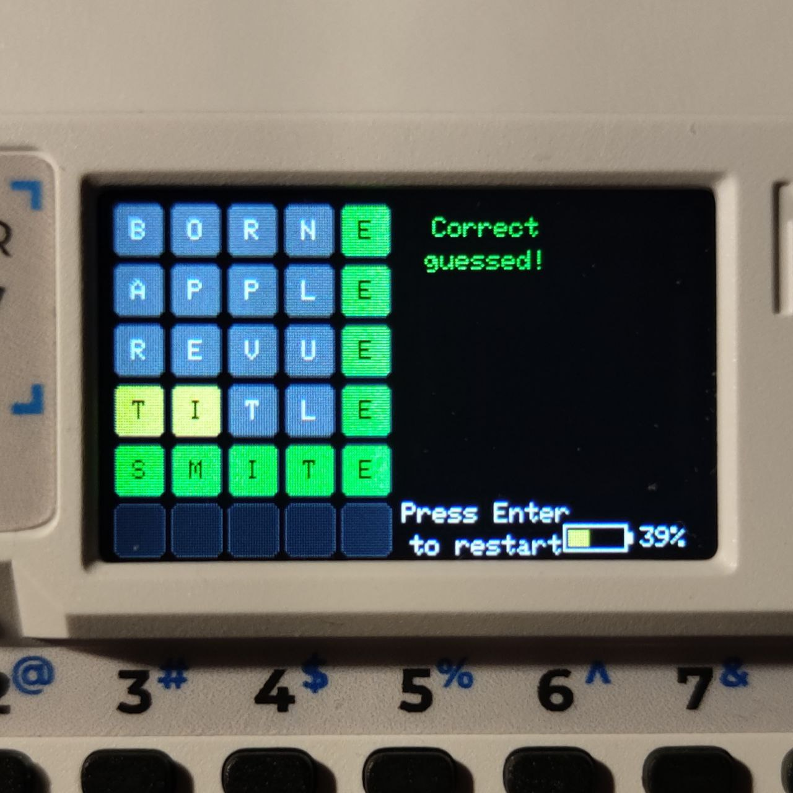

# Wordle for Cardputer Adv.


**Wordle** - the popular word game is now available on **Cardputer Adv**!

<p align="center">
  
</p>

## Features

* ✅ Over *2000* words from the official Wordle dictionary
* ✅ Real-time word validation
* ✅ Fully offline, **no SD card required**
* ✅ No SPIFFS needed
* ✅ Battery monitor

## Future Plans

* "Word of the Day" mode
* Save high scores to SD card or online account
* Add custom words to the dictionary
* Sound effects

## Installation and Usage

1. Clone the repository to your computer:

   ```bash
   git clone https://github.com/your-username/wordle-cardputer.git
   ```

2. Open the project as a **PlatformIO Project** in your IDE (e.g., VSCode with PlatformIO extension).

3. Build and upload the project to your Cardputer Adv:

   ```bash
   pio run
   pio run --target upload
   ```

   Alternatively, you can download the precompiled **.bin** file from the GitHub [Releases](https://github.com/your-username/wordle-cardputer/releases) page and flash it directly to your device.

4. Once uploaded, launch the game on your Cardputer and enjoy Wordle offline!

## Contributing

If you have ideas for improvements or new words for the dictionary, feel free to submit a Pull Request!

## License

This project is licensed under the Apache 2.0 License.

---

Play Wordle directly on your Cardputer Adv and enjoy the official dictionary offline!
